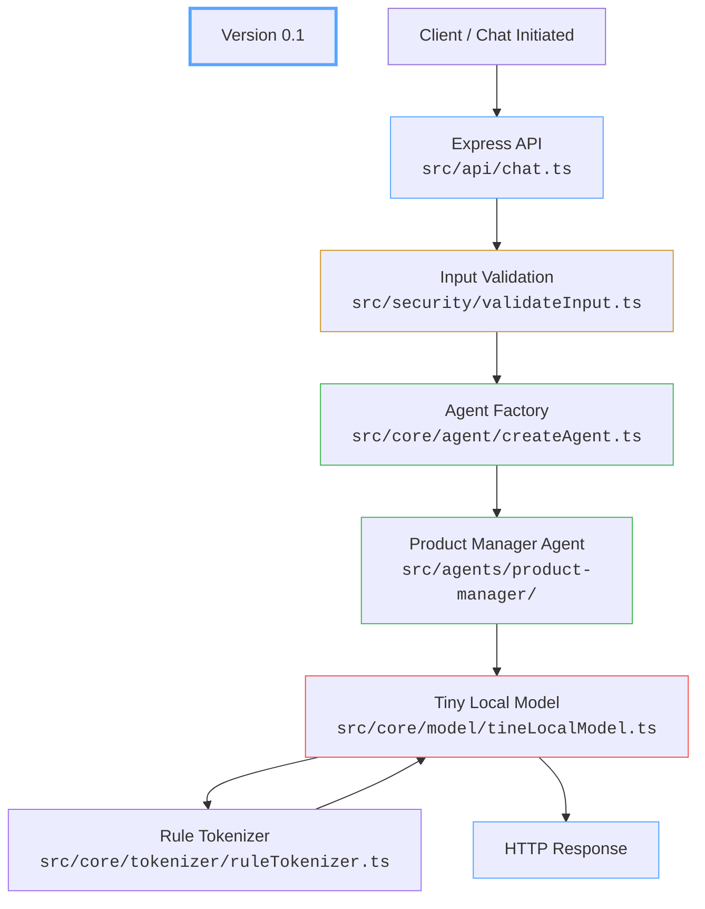

# FAI Agent Platform

Felicia Ainslie Insights (FAI) Platform is a from-scratch TypeScript project for building reusable, local-first AI agents that can run without paid APIs or hosted model providers.

**Table of Contents**
- [FAI Agent Platform](#fai-agent-platform)
  - [Goal](#goal)
  - [Why this project exists](#why-this-project-exists)
  - [Project Status](#project-status)
    - [Phase 1 - Foundation](#phase-1---foundation)
    - [Phase 2 - Language Modeling](#phase-2---language-modeling)
    - [Phase 3 - Neural Networks](#phase-3---neural-networks)
    - [Phase 4 - Specialized Agents](#phase-4---specialized-agents)
    - [Phase 5 - Language Modeling Experiments](#phase-5---language-modeling-experiments)
    - [Roadmap](#roadmap)
  - [Architecture](#architecture)
  - [Running the Application](#running-the-application)
  - [Testing the Product Manager Agent](#testing-the-product-manager-agent)
  - [Tokenizer Demo](#tokenizer-demo)
  - [License](#license)

## Goal

Learn and build every major layer of an AI system from the ground up:

- Tokenization
- Training data pipelines
- N-gram models
- Neural language models
- Inference
- Agent architecture
- Domain-specific AI assistants

The long-term goal is to create reusable, cost-free local deployment agents that remain understandable, modifiable, and independent of OpenAI, Ollama, or other hosted providers.

---

## Why this project exists

This repository prioritizes:

- Learning over convenience
- Transparency over abstraction
- Local execution over cloud dependency
- Reusable architecture over one-off solutions
- Low operating costs

Every major component is intended to be understandable, replaceable, and easy to extend.

---

## Project Status

**Version 0.1:** Early Prototype

This checklist serves as both the development roadmap and the current implementation status.

### Phase 1 - Foundation

Build the core framework required for every future AI component.


Express API
- [x] Agent framework
- [x] Product manager agent
- [x] <code>POST /chat/product-manager</code> endpoint
- [x] Input validation
- [x] Simple tokenizer (learning implementation)
- [x] Local placeholder language model
- [x] Reusable agent architecture
- [x] Basic Unit Tests

**Status:** Complete

### Phase 2 - Language Modeling

Expand the local model beyond simple rules into a statistical language model.

- [x] Enhanced tokenizer
- [ ] Vocabulary builder
- [ ] Token frequency analysis
- [ ] N-Gram prediction engine
- [ ] Model evaluation franework

**Current Focus:** Building a reusable vocabulary system.

### Phase 3 - Neural Networks

Transition from handcrafted rules into trainable machine learning models.

- [ ] Trainable neural language model
- [ ] Learned embeddings
- [ ] Attention experiments
- [ ] Transformer research

### Phase 4 - Specialized Agents

Expand the platform into reusable domain-specific AI agents.

- [ ] Product Manager Agent v2
- [ ] Fishkeeping Agent
- [ ] Kid safe "Ask Mom" Agent

### Phase 5 - Language Modeling Experiments

Research and compare multiple tokenization strategies.

- [ ] BPE Tokenizer
- [ ] WordPiece Tokenizer
- [ ] Unigram Tokenizer
- [ ] FAI Tokenizer (custom implementation)

### Roadmap

The next milestones are focused on turning this prototype into a more capable local agent platform:


**Version 0.1:** Early Prototype

This checklist serves as both the development roadmap and the current implementation status.

### Phase 1 - Foundation

Build the core framework required for every future AI component.

- [x] Express API
- [x] Agent framework
- [x] Product manager agent
- [x] <code>POST /chat/product-manager</code> endpoint
- [x] Input validation
- [x] Simple tokenizer (learning implementation)
- [x] Local placeholder language model
- [x] Reusable agent architecture
- [x] Basic Unit Tests

**Status:** Complete

### Phase 2 - Language Modeling

Expand the local model beyond simple rules into a statistical language model.

- [x] Enhanced tokenizer
- [ ] Vocabulary builder
- [ ] Token frequency analysis
- [ ] N-Gram prediction engine
- [ ] Model evaluation franework

**Current Focus:** Building a reusable vocabulary system.

### Phase 3 - Neural Networks

Transition from handcrafted rules into trainable machine learning models.

- [ ] Trainable neural language model
- [ ] Learned embeddings
- [ ] Attention experiments
- [ ] Transformer research

### Phase 4 - Specialized Agents

Expand the platform into reusable domain-specific AI agents.

- [ ] Product Manager Agent v2
- [ ] Fishkeeping Agent
- [ ] Kid safe "Ask Mom" Agent

### Phase 5 - Language Modeling Experiments

Research and compare multiple tokenization strategies.

- [ ] BPE Tokenizer
- [ ] WordPiece Tokenizer
- [ ] Unigram Tokenizer
- [ ] FAI Tokenizer (custom implementation)

### Roadmap

The next milestones are focused on turning this prototype into a more capable local agent platform:

1. Build a stronger local inference layer using n-gram or neural methods.
2. Introduce a reusable vocabulary system and token IDs to support more realistic model inputs.
3. Expand the agent framework so new agents can be added with minimal duplication.
4. Add persistence and memory so agents can retain state across interactions.
5. Continue evolving the tokenizer stack toward BPE and other modern approaches.
6. Build a trainable language model from scratch.
7. Develop specialized agents that share the same underlying inference engine.
8. Add authentication, configuration, and deployment features suitable for production environments.

---

## Architecture

The current structure is intentionally simple and is organized by responsibility rather than feature, making individual AI components easy to replace or extend as the platform evolves.

- [src/index.ts](src/index.ts) boots the Express server and mounts the chat routes.
- [src/api/chat.ts](src/api/chat.ts) handles HTTP requests for agent interactions.
- [src/security/validateInput.ts](src/security/validateInput.ts) validates incoming chat payloads.
- [src/agents/product-manager/index.ts](src/agents/product-manager/index.ts) defines the current domain-specific agent.
- [src/core/agent/createAgent.ts](src/core/agent/createAgent.ts) provides a reusable agent wrapper.
- [src/core/model/tinyLocalModel.ts](src/core/model/tinyLocalModel.ts) acts as a local inference placeholder. It tokenizes input and returns a formatted response, but it does not learn or generate meaningfully yet.
- [src/core/tokenizer/ruleTokenizer.ts](src/core/tokenizer/ruleTokenizer.ts) converts text into predictable tokens for experimentation and future model work.

<br>



---

## Running the Application

Install dependencies:

```bash
npm install
```

Start the API:

```bash
npm run dev
```

Expected output:

```txt
FAI agent platform running on port 3001
```

---

## Testing the Product Manager Agent

Send a test request:

```bash
curl -X POST http://localhost:3001/chat/product-manager \
  -H "Content-Type: application/json" \
  -d '{"message":"POST /chat/product-manager works, right?"}'
```

Expected response structure:

```json
{
  "response": "Local FAI model response:

I tokenized your message into X tokens.

Tokens:
agent
config
role
...
post
/chat/product
-
manager
works
,
right
?

Next model step: replace this placeholder with a trained local text generator:
}
```

Notes:
- Token count may change as tokenizer rules evolve.
- System prompt tokens currently appear because the Product Manager agent prompt and user message are combined before tokenization.
- Seeing words such as:
  - agent
  - config
  - role
  - product
  - artifacts
 
  indicates the system prompt is being included correctly.

- Seeing:
  - post
  - /chat/product
  - manager
  - works
  - ?
 
  indicates the user message is being tokenized correctly.

---

## Tokenizer Demo

The tokenizer can be executed independently from the API.

Purpose:
- Verify rule-based tokenizer behavior
- Experiment with tokenizer rules
- Compare tokenizer versions
- Support regression testing while building later AI layers

Run:

```bash
npx tsx src/core/tokenizer/ruleTokenizer.demo.ts
```

Example output:

```txt
INPUT:
Hello, world!

TOKENS:
["hello", ",", "world", "!"]

DECODED:
hello, world!
```

---

## License

[MIT](https://github.com/Felicia-Ainslie/fai-agent-platform/blob/main/LICENSE)
