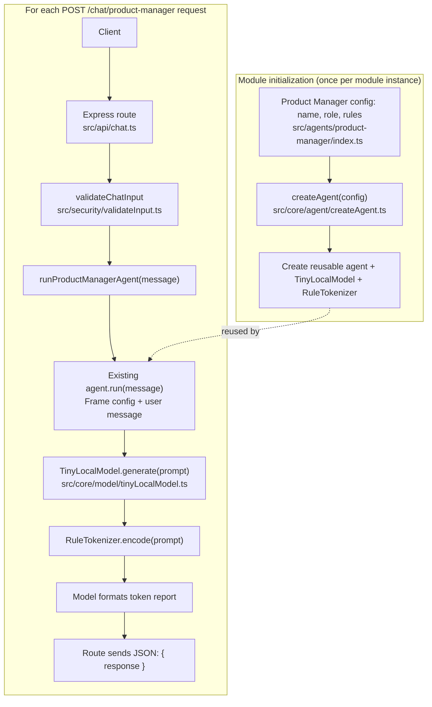

# FAI Agent Platform

Felicia Ainslie Insights (FAI) Platform is a from-scratch TypeScript project for building reusable, local-first AI agents that can run without paid APIs or hosted model providers.

**Table of Contents**
- [FAI Agent Platform](#fai-agent-platform)
  - [Goal](#goal)
  - [Why this project exists](#why-this-project-exists)
  - [Project Status](#project-status)
    - [Phase 1 - Foundation](#phase-1---foundation)
    - [Phase 2 - Language Modeling](#phase-2---language-modeling)
    - [Phase 3 - Neural Networks](#phase-3---neural-networks)
    - [Phase 4 - Specialized Agents](#phase-4---specialized-agents)
    - [Phase 5 - Language Modeling Experiments](#phase-5---language-modeling-experiments)
    - [Roadmap](#roadmap)
  - [Architecture](#architecture)
    - [Initialization versus request flow](#initialization-versus-request-flow)
  - [Running the Application](#running-the-application)
  - [Testing the Product Manager Agent](#testing-the-product-manager-agent)
  - [Tokenizer Demos](#tokenizer-demos)
  - [License](#license)

## Goal

Learn and build every major layer of an AI system from the ground up:

- Tokenization
- Training data pipelines
- N-gram models
- Neural language models
- Inference
- Agent architecture
- Domain-specific AI assistants

The long-term goal is to create reusable, cost-free local deployment agents that remain understandable, modifiable, and independent of OpenAI, Ollama, or other hosted providers.

---

## Why this project exists

This repository prioritizes:

- Learning over convenience
- Transparency over abstraction
- Local execution over cloud dependency
- Reusable architecture over one-off solutions
- Low operating costs

Every major component is intended to be understandable, replaceable, and easy to extend.

---

## Project Status

**Version 0.1:** Early Prototype

The npm package metadata in
[package.json](package.json) currently declares `1.0.0`; that is separate from
these learning milestones and does not indicate production readiness.

This checklist serves as both the development roadmap and the current implementation status.

### Phase 1 - Foundation

Build the core framework required for every future AI component.


Express API
- [x] Agent framework
- [x] Product manager agent
- [x] <code>POST /chat/product-manager</code> endpoint
- [x] Input validation
- [x] Simple tokenizer (learning implementation)
- [x] Local placeholder language model
- [x] Reusable agent architecture
- [x] Basic Unit Tests

**Status:** Complete

### Phase 2 - Language Modeling

Expand the local model beyond simple rules into a statistical language model.

- [x] Enhanced tokenizer
- [ ] Vocabulary builder
- [ ] Token frequency analysis
- [ ] N-Gram prediction engine
- [ ] Model evaluation franework

**Current Focus:** Building a reusable vocabulary system.

### Phase 3 - Neural Networks

Transition from handcrafted rules into trainable machine learning models.

- [ ] Trainable neural language model
- [ ] Learned embeddings
- [ ] Attention experiments
- [ ] Transformer research

### Phase 4 - Specialized Agents

Expand the platform into reusable domain-specific AI agents.

- [ ] Product Manager Agent v2
- [ ] Fishkeeping Agent
- [ ] Kid safe "Ask Mom" Agent

### Phase 5 - Language Modeling Experiments

Research and compare multiple tokenization strategies.

- [ ] BPE Tokenizer
- [ ] WordPiece Tokenizer
- [ ] Unigram Tokenizer
- [ ] FAI Tokenizer (custom implementation)

### Roadmap

The next milestones are focused on turning this prototype into a more capable local agent platform:


**Version 0.1:** Early Prototype

This checklist serves as both the development roadmap and the current implementation status.

### Phase 1 - Foundation

Build the core framework required for every future AI component.

- [x] Express API
- [x] Agent framework
- [x] Product manager agent
- [x] <code>POST /chat/product-manager</code> endpoint
- [x] Input validation
- [x] Simple tokenizer (learning implementation)
- [x] Local placeholder language model
- [x] Reusable agent architecture
- [x] Basic Unit Tests

**Status:** Complete

### Phase 2 - Language Modeling

Expand the local model beyond simple rules into a statistical language model.

- [x] Enhanced tokenizer
- [ ] Vocabulary builder
- [ ] Token frequency analysis
- [ ] N-Gram prediction engine
- [ ] Model evaluation franework

**Current Focus:** Building a reusable vocabulary system.

### Phase 3 - Neural Networks

Transition from handcrafted rules into trainable machine learning models.

- [ ] Trainable neural language model
- [ ] Learned embeddings
- [ ] Attention experiments
- [ ] Transformer research

### Phase 4 - Specialized Agents

Expand the platform into reusable domain-specific AI agents.

- [ ] Product Manager Agent v2
- [ ] Fishkeeping Agent
- [ ] Kid safe "Ask Mom" Agent

### Phase 5 - Language Modeling Experiments

Research and compare multiple tokenization strategies.

- [ ] BPE Tokenizer
- [ ] WordPiece Tokenizer
- [ ] Unigram Tokenizer
- [ ] FAI Tokenizer (custom implementation)

### Roadmap

The next milestones are focused on turning this prototype into a more capable local agent platform:

1. Build a stronger local inference layer using n-gram or neural methods.
2. Introduce a reusable vocabulary system and token IDs to support more realistic model inputs.
3. Expand the agent framework so new agents can be added with minimal duplication.
4. Add persistence and memory so agents can retain state across interactions.
5. Continue evolving the tokenizer stack toward BPE and other modern approaches.
6. Build a trainable language model from scratch.
7. Develop specialized agents that share the same underlying inference engine.
8. Add authentication, configuration, and deployment features suitable for production environments.

---

## Architecture

The current structure separates responsibilities so each layer can evolve as the project grows. This is a learning architecture, not a fully pluggable dependency-injection system yet.

- [src/index.ts](src/index.ts) boots Express, configures CORS and JSON parsing, exposes `/health`, and mounts the chat routes.
- [src/api/chat.ts](src/api/chat.ts) validates each request and wraps the agent result in a JSON response.
- [src/security/validateInput.ts](src/security/validateInput.ts) validates incoming chat payloads.
- [src/agents/product-manager/index.ts](src/agents/product-manager/index.ts) supplies the active agent name, role, and rules. It calls `createAgent(config)` once when the module loads, then reuses that agent for requests.
- [src/core/agent/createAgent.ts](src/core/agent/createAgent.ts) constructs a `TinyLocalModel` and returns an agent with a `run(message)` method. Each run combines the configuration and user message into a framed prompt.
- [src/core/model/tinyLocalModel.ts](src/core/model/tinyLocalModel.ts) constructs a `RuleTokenizer`. Its `generate()` method tokenizes the framed prompt and reports those tokens; it is not a trained language model and does not follow the instructions semantically.
- [src/core/tokenizer/ruleTokenizer.ts](src/core/tokenizer/ruleTokenizer.ts) is the current tokenizer. [SimpleTokenizer](src/core/tokenizer/simpleTokenizer.ts) remains available as the earlier implementation for comparison.

### Initialization versus request flow

The factory is called during module initialization, not after validation on every request:


```mermaid
flowchart TD
  subgraph Initialization["Module initialization (once per module instance)"]
    Config["Product Manager config: name, role, rules<br/>src/agents/product-manager/index.ts"] --> Factory["createAgent(config)<br/>src/core/agent/createAgent.ts"]
    Factory --> Instances["Create reusable agent + TinyLocalModel + RuleTokenizer"]
  end

  subgraph Requests["For each POST /chat/product-manager request"]
    Client["Client"] --> API["Express route<br/>src/api/chat.ts"]
    API --> Validation["validateChatInput<br/>src/security/validateInput.ts"]
    Validation --> PM["runProductManagerAgent(message)"]
    PM --> Run["Existing agent.run(message)<br/>Frame config + user message"]
    Run --> Model["TinyLocalModel.generate(prompt)<br/>src/core/model/tinyLocalModel.ts"]
    Model --> Tokenizer["RuleTokenizer.encode(prompt)"]
    Tokenizer --> Format["Model formats token report"]
    Format --> Response["Route sends JSON: { response }"]
  end

  Instances -. reused by .-> Run
```

**Where to swap implementations:** the model is currently selected by its import and construction in `createAgent.ts`; the tokenizer is selected in `tinyLocalModel.ts`. Both tokenizers expose `encode()` and `decode()` for string tokens, but there is no shared interface or runtime selector yet. Keeping these responsibilities separate makes later experiments easier without claiming those future extension points already exist.

**What about `systemPrompt.ts`?** [src/agents/product-manager/systemPrompt.ts](src/agents/product-manager/systemPrompt.ts) exports a separate, fuller Product Manager role description and guidelines. Nothing currently imports that export. It is retained, but it is not the active prompt source and does not affect responses. The active instructions are the `name`, `role`, and `rules` in `product-manager/index.ts`, framed by `createAgent.ts`. Neither prompt source is changed here.

---

## Running the Application

Use Node.js 24.x. The locked test/build tooling is compatible with `^20.19.0 || ^22.12.0 || >=24.0.0`; compatibility with a dependency's engine range is not a claim that every version has been tested.

Install the locked dependencies:

```bash
npm ci
```

Optional local configuration:

```bash
cp .env.example .env
```

| Variable | Default | Purpose |
| --- | --- | --- |
| `PORT` | `3001` | API listening port. |
| `ALLOWED_ORIGIN` | `http://localhost:3000` | Browser origin allowed by the CORS configuration. This is not authentication. |

Start the development API:

```bash
npm run dev
```

With the default port, the server's startup message is:

```txt
FAI agent platform running on port 3001
```

The existing npm scripts are:

| Command | Purpose |
| --- | --- |
| `npm run dev` | Run `src/index.ts` with `tsx`. |
| `npm run build` | Compile TypeScript to `dist/` using `tsc`. |
| `npm start` | Run the compiled server (`npm run build` first). |
| `npm test` | Run Vitest in its default interactive/watch mode. |
| `npm run test:run` | Run the unit test suite once. |

There is no separate lint script. Before proposing changes, run:

```bash
npm run test:run
npm run build
npm run test:run
```

Check that the server is responsive:

```bash
curl http://localhost:3001/health
```

Expected JSON:

```json
{"status":"ok","service":"fai-agent-platform"}
```

Use your configured port in requests if you change `PORT`.

---

## Testing the Product Manager Agent

Send a test request while the API is running:

```bash
curl -X POST http://localhost:3001/chat/product-manager \
  -H "Content-Type: application/json" \
  -d '{"message":"POST /chat/product-manager works, right?"}'
```

Expected response with the current agent configuration and tokenizer (the line breaks inside the string are escaped to keep this valid JSON):

```json
{
  "response": "Local FAI model response:\n\nI tokenized your message into 76 tokens.\n\nTokens:\nagent | : | fai | product | manager | agent | role | : | product | management | assistant | for | structured | product | thinking | . | rules | : | - | create | clear | product | artifacts | . | - | use | assumptions | when | context | is | incomplete | . | - | prefer | structured | outputs | without | emojis | or | dashes | . | - | do | not | invent | company | - | specific | facts | . | - | seperate | problem | , | users | , | requirements | , | risks | , | and | success | metrics | . | user | message | : | post | /chat | /product | - | manager | works | , | right | ?\n\nNext model step: replace this placeholder with a trained local text generator"
}
```

Notes:
- The 76 tokens cover the **entire framed prompt**, not just the user's message: agent name, role, rules, framing labels, and message.
- The active configuration supplies tokens such as `agent`, `role`, `rules`, and `artifacts`; these do not come from the unused `systemPrompt.ts` export. The existing `Seperate` spelling in the active rules is reflected as `seperate` in this example, not silently corrected in the prompt.
- The route-like text becomes `post`, `/chat`, `/product`, `-`, `manager`, `works`, `,`, `right`, `?`. The tokenizer does not keep the whole route as one token.
- The count and response will change when the configuration, input, or tokenizer changes. This is a deterministic token report, not a generated Product Manager answer.

---

## Tokenizer Demos

Both implementations can be executed independently of the API. The earlier `SimpleTokenizer` demo is preserved under its own name, and the `RuleTokenizer` demo uses the current implementation. They use the same five inputs to make the progression visible:

```bash
npx tsx src/core/tokenizer/simpleTokenizer.demo.ts
npx tsx src/core/tokenizer/ruleTokenizer.demo.ts
```

Alternatively, run the compiled demos after `npm run build`:

```bash
node dist/core/tokenizer/simpleTokenizer.demo.js
node dist/core/tokenizer/ruleTokenizer.demo.js
```

Both implementations lowercase input by default and split text using regular expressions; `SimpleTokenizer` is not merely a whitespace splitter. The demos print token arrays as JSON so the output can be compared directly.

For `Hello, world!`, **SimpleTokenizer (v1)** prints:

```txt
INPUT:
Hello, world!
TOKENS:
["hello",",","world","!"]
DECODED:
hello , world !
```

For the same input, **RuleTokenizer (v2)** prints:

```txt
INPUT:
Hello, world!
TOKENS:
["hello",",","world","!"]
DECODED:
hello, world!
```

The shared samples also expose differences beyond punctuation spacing:

| Input | SimpleTokenizer tokens | RuleTokenizer tokens |
| --- | --- | --- |
| `POST /chat/product-manager works.` | `["post","/","chat","/","product","-","manager","works","."]` | `["post","/chat","/product","-","manager","works","."]` |
| `I can't wait.` | `["i","can","'","t","wait","."]` | `["i","can't","wait","."]` |

`SimpleTokenizer.decode()` joins all tokens with spaces. `RuleTokenizer.decode()` removes spaces before common punctuation, but still decodes the route sample as `post /chat /product - manager works.`. Neither decoder restores the original text exactly; lowercasing and formatting loss are current tradeoffs, not bugs fixed by these demos. Only `RuleTokenizer` supports opting out of lowercasing via `{ lowercase: false }`.

Use these demos for manual inspection and experimentation alongside the existing automated tests; printing a sample is not itself a regression assertion.

---

## License

[MIT](https://github.com/Felicia-Ainslie/fai-agent-platform/blob/main/LICENSE)

